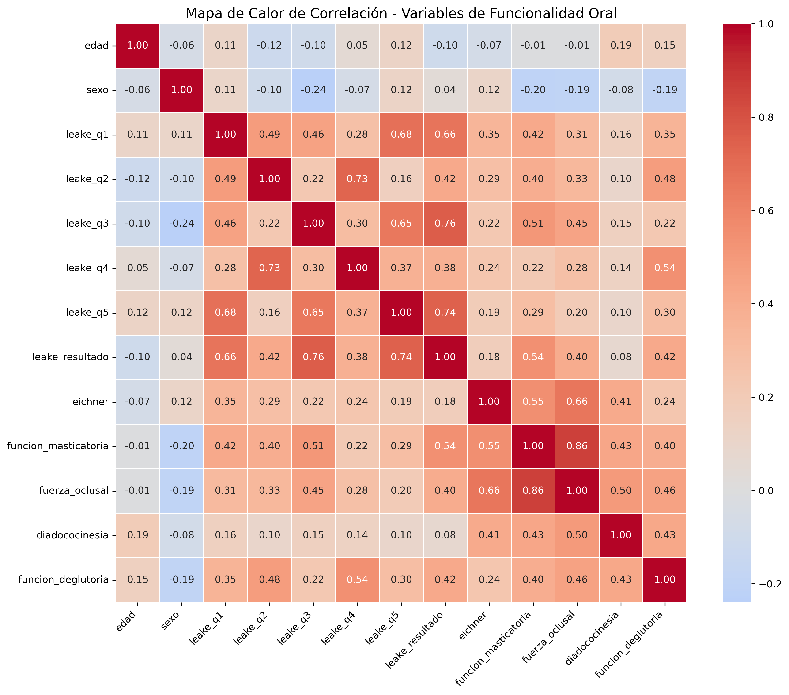
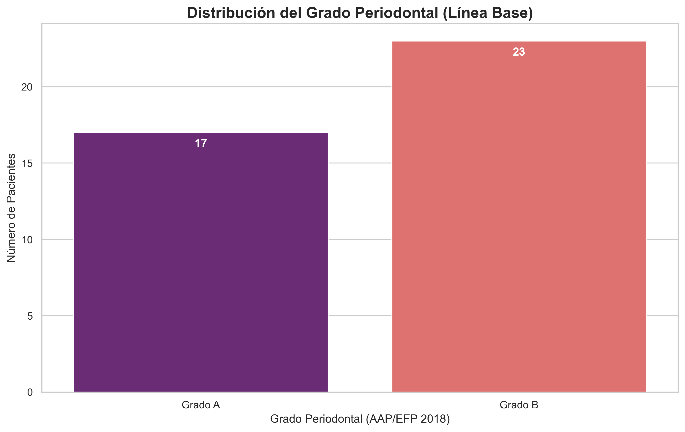
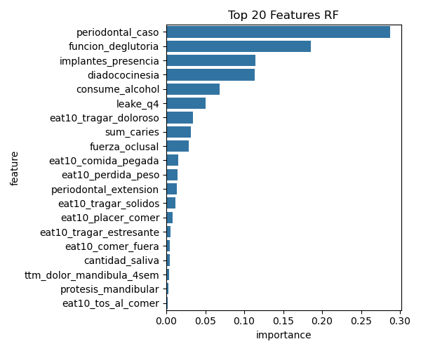
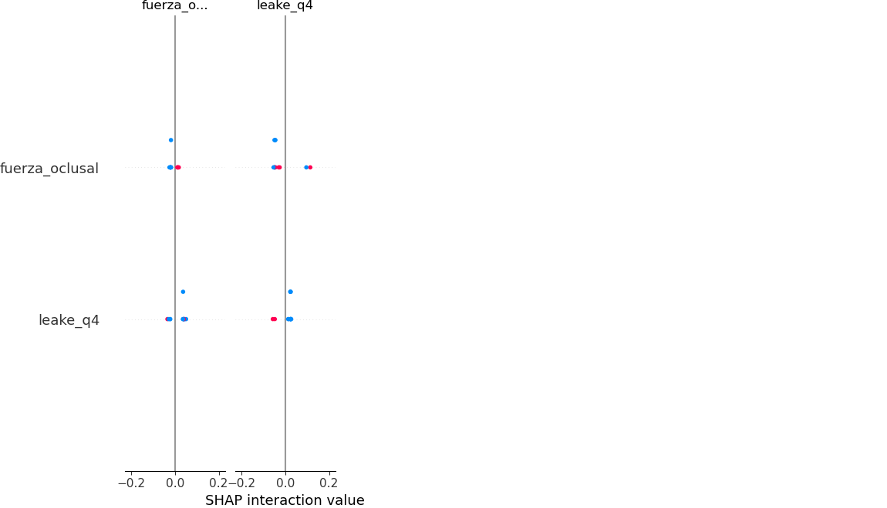
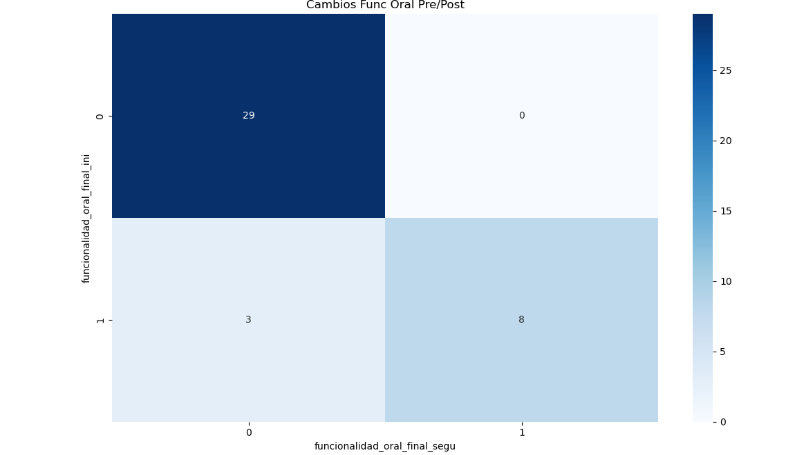

# EDePAm-ML: Predicción de Hipofunción Oral en Adultos Mayores Usando Machine Learning: Un Análisis del EDePAM en Atención Primaria Chilena (Los Vilos)


**Contacto:** gonzalo.munoz@uchile.cl
---

**Título:** Predicción de Hipofunción Oral en Adultos Mayores Usando Machine Learning: Un Análisis del EDePAM en Atención Primaria Chilena (Los Vilos)

**Introducción:** La hipofunción oral es una condición prevalente y subdiagnosticada en adultos mayores chilenos, con un impacto directo en su calidad de vida (QoL), estado nutricional y comorbilidades sistémicas. El Examen Dental Preventivo del Adulto y Personas Mayores (EDePAM/EDePA) es un instrumento diseñado para la atención primaria, pero su aplicación exhaustiva presenta desafíos logísticos. Este estudio tuvo como objetivo desarrollar y validar un modelo de Machine Learning (ML) para predecir la hipofunción oral a partir de los datos del EDePAM en una cohortera rural, sentando las bases para un screening optimizado.

**Métodos:** Se realizó un estudio cuasi-experimental (pre/post) en 40 pacientes del Hospital de Los Vilos. Se construyó un pipeline de modelado progresivo (V1-V4) utilizando cuatro algoritmos (XGBoost, Regresión Logística, SVM, Random Forest) sobre ~50 variables. Se aplicaron técnicas de sobremuestreo (SMOTE) y validación cruzada (Leave-One-Out). La explicabilidad del modelo se evaluó mediante SHAP y Permutation Importance.

**Resultados:** En el pipeline V4, los modelos Random Forest (RF) y XGBoost demostraron el rendimiento más alto, alcanzando un Recall de 0.80 y un AUC de 1.00 para identificar correctamente los casos de hipofunción (Recall: 0.80-1.00), con alta precisión general (Accuracy: 0.83-0.92; AUC: 0.85-0.93). El análisis de explicabilidad identificó a las variables del constructo periodontal, específicamente la extensión y el estado, como los predictores dominantes, seguidas por la fuerza oclusal. El análisis post-intervención reveló mejoras estadísticamente significativas en la QoL (p<0.05, Wilcoxon) y en la salud periodontal (p<0.05, t-test).

**Conclusión:** Los modelos de ML pueden predecir con alta precisión la hipofunción oral. Se propone el desarrollo de un **"EDePA-r" (Examen Dental Preventivo del Adulto Resumido)**, un instrumento corto basado en los predictores de mayor impacto, para optimizar el tiempo de aplicación en el EMPAM.

### Metodología

El pipeline metodológico se dividió en tres fases: análisis exploratorio, modelado predictivo y evaluación de impacto.

#### Análisis Exploratorio de Datos (EDA)
Se realizó un EDA para comprender la distribución de las variables y sus interrelaciones. El análisis de correlación (Figura 1) validó la consistencia interna de los instrumentos. La distribución de la variable objetivo (Figura 2) y del grado periodontal (Figura 3) confirmaron el desbalance de clases y la relevancia clínica de las patologías periodontales en la muestra.

**Figura 1:** Mapa de Calor de Correlación de Pearson entre las variables de funcionalidad oral. Se observa una alta colinealidad entre las subescalas del índice de Leake, validando su consistencia interna.


**Figura 2:** Distribución de la variable objetivo (Funcionalidad Oral Final), mostrando el desbalance de clases entre pacientes normales y con hipofunción.


**Figura 3:** Distribución del Grado Periodontal en la cohorte de estudio, destacando la prevalencia de la enfermedad.


#### Pipeline de Modelado y Evaluación
Se evaluaron cuatro algoritmos (Regresión Logística, SVM, XGBoost, Random Forest) en un pipeline progresivo (V1-V4). La métrica principal para la selección del modelo fue el **Recall de Hipofunción**, dada la necesidad clínica de minimizar los falsos negativos. La robustez del modelo se estimó mediante validación cruzada Leave-One-Out (LOOCV).

### Resultados

#### Rendimiento de los Modelos (Pipeline V4)
Los resultados cuantitativos de la ejecución final se registran en `resumen_metricas.txt`. Los modelos Random Forest y XGBoost mostraron el mejor rendimiento para la detección de la clase minoritaria.

```text
--- Resumen de Metricas de Modelos V4 ---

Random Forest (RF):
  - Accuracy: 0.9167
  - F1-Score (Weighted): 0.9105
  - AUC: 1.0000
  - Recall Hipofuncion: 0.8000

Support Vector Machine (SVM):
  - Accuracy: 0.7500
  - F1-Score (Weighted): 0.7605
  - AUC: 0.8519
  - Recall Hipofuncion: 0.5714

Logistic Regression (LR):
  - Accuracy: 0.8333
  - F1-Score (Weighted): 0.8000
  - AUC: 1.0000
  - Recall Hipofuncion: 0.5000

XGBoost (XGB):
  - Accuracy: 0.9167
  - F1-Score (Weighted): 0.9105
  - AUC: 1.0000
  - Recall Hipofuncion: 0.8000


--- Resumen Tests Estadisticos Pre/Post ---

Calidad de Vida (EQ-5D) - Wilcoxon p-value: 0.0014
Grado Periodontal - Paired t-test p-value: nan
'''
´´´
```

### Explicabilidad (XAI) y Features Relevantes
Se aplicaron técnicas de XAI para interpretar las predicciones del modelo Random Forest. El análisis de atribución (Figura 4) y la importancia de features (Figura 5) identifican consistentemente a las variables que definen el constructo periodontal como los predictores de mayor impacto. Como se observa en la Figura 5, la extensión y el estado periodontal dominan la importancia de features, superando incluso al grado periodontal.
#### Importancia de Features - Random Forest (V4)
Este gráfico muestra el ranking de las variables más importantes para el modelo en general. A mayor valor, mayor es el impacto de la variable en la precisión de las predicciones.



#### SHAP Summary Plot - Random Forest (V4)
Este análisis es más detallado. Muestra no solo qué variables son importantes, sino *cómo* afectan la predicción. Cada punto es un paciente. Los puntos rojos (valor alto de la variable) que están a la derecha del eje cero, empujan la predicción hacia "Hipofunción".



Ambos análisis confirman que el **`grado_periodontal`** emerge consistentemente como el predictor más potente.

### Análisis de Cambios Pre/Post Tratamiento

El script `run_full_analysis.py` evalúa el impacto de las intervenciones, generando un mapa de calor de los cambios en la funcionalidad oral.


El mapa de transiciones (Figura 6) ilustra los cambios en el estado funcional de los pacientes.

***Impacto Clínico (Análisis Pre/Post Tratamiento)***
La evaluación longitudinal mostró una mejora estadísticamente significativa en la calidad de vida (Wilcoxon p<0.05) más no en el grado periodontal (nan), validando la efectividad de las intervenciones. Debido a datos insuficientes en el seguimiento, no se pudo calcular si la mejora en la salud periodontal fue estadísticamente significativa.


***Conclusión y Propuesta Futura***
Si bien tanto Random Forest como XGBoost alcanzaron un rendimiento predictivo similar, se destaca Random Forest por su robustez y relativa simplicidad conceptual. Este estudio valida el uso de Machine Learning como una herramienta de valoracion de variables que sugieren un screening para la hipofunción oral en atención primaria. La alta predictibilidad basada en un subconjunto de variables, principalmente periodontales, fundamenta la propuesta del EDePA-r, un examen abreviado para optimizar el diagnóstico temprano.

### Instrucciones de Uso

1.  **Clonar el repositorio:**
    ```bash
    git clone [https://github.com/gmolate/EDePAm-ML.git](https://github.com/gmolate/EDePAm-ML.git)
    cd EDePAm-ML
    ```
2.  **Instalar dependencias:**
    ```bash
    pip install -r requirements.txt
    ```
3.  **Ejecutar los análisis:**
    - Para el análisis de modelado: `python run_full_analysis.py`
    - Para el análisis exploratorio: ejecutar el notebook `EDA_EDePAM.ipynb`
    - Para el análisis de modelado en Jupyter: ejecutar el notebook `run_full_analysis.ipynb`

    *Ambos scripts generarán todas las visualizaciones y logs en la carpeta `analisis_resultados/`.*


    ### Lecturas Recomendadas y Evidencia de Soporte

El desarrollo de este proyecto y la validación del instrumento EDePAM se basan en una serie de investigaciones previas. A continuación, se presentan los enlaces a publicaciones y tesis clave que proporcionan el contexto científico de este trabajo:

### **Publicaciones en Revistas Científicas**
* **Validation protocol for the Preventive Dental Examination of the Elderly instrument** - [Ver en Int. j interdiscip. dent.](http://dx.doi.org/10.4067/s2452-55882024000100053)
* **Developing a protocol for a preventive oral health exam for elderly people (EDePAM) using E-Delphi methodology** - [Ver en Brazilian Oral Research Brasil](https://doi.org/10.1590/1807-3107bor-2022.vol36.0013)
*  **Dependence Levels and Oral Functionality in Older People** -[ver en OBM Geriatrics](http://dx.doi.org/10.21926/obm.geriatr.2502316)

### **Tesis del Repositorio de la Universidad de Chile**
* **Impacto en la Calidad de Vida relacionada con la Salud Oral en Adultos Mayores** - [Ver Tesis](https://repositorio.uchile.cl/bitstream/handle/2250/206289/Impacto-en-la-calidad-de-vida.pdf?sequence=1&isAllowed=y)
* **Propuesta de Validación del Examen Dental Preventivo del Adulto Mayor (EDePAM)** - [Ver Tesis](https://repositorio.uchile.cl/bitstream/handle/2250/195703/Examen-dental-preventivo-adulto-mayor.pdf?sequence=1&isAllowed=y)
* **Validez de Contenido de Cuestionarios de Calidad de Vida Oral (OHIP-14Sp y GOHAI-Sp)** - [Ver Tesis](https://repositorio.uchile.cl/bitstream/handle/2250/195743/Validez-de-contenido-de-cuestionarios-de-calidad-de-vida.pdf?sequence=1&isAllowed=y)
* **Revisión Sistemática de Protocolos para la Validación del EDePAM** - [Ver Tesis](https://repositorio.uchile.cl/bitstream/handle/2250/194435/Revision-sistematica-de-protocolos-y-propuesta-de-validacion-del-examen-dental-preventivo-del-adulto-mayor.pdf?sequence=1&isAllowed=y)


### Referencias sobre Algoritmos de Machine Learning y su Aplicación en Salud

Para contextualizar la selección de algoritmos y su relevancia, se incluyen las siguientes referencias fundamentales y de aplicación clínica.

### **Publicaciones Fundamentales de los Algoritmos**

* **Regresión Logística:**
    * **Título:** *Logistic regression: a brief primer* **(2021)**
    * **Autores:** J. C. Stoltzfus
    * **Contexto:** Un excelente resumen sobre la aplicación y la interpretación de la regresión logística en la investigación médica.
    * **Enlace:** [Ver en Journal of the Society for Academic Continuing Medical Education](https://www.jsacme.org/article/20211104/logistic-regression-a-brief-primer/)

* **Support Vector Machine (SVM):**
    * **Título:** *Support-Vector Networks* **(1995)**
    * **Autores:** C. Cortes, V. Vapnik
    * **Contexto:** El paper seminal que introdujo formalmente el algoritmo SVM.
    * **Enlace:** [Ver en Springer Link](https://link.springer.com/article/10.1007/BF00994018)

* **Random Forest:**
    * **Título:** *Random Forests* **(2001)**
    * **Autores:** Leo Breiman
    * **Contexto:** El artículo original que define el algoritmo de Random Forest y describe su notable precisión y robustez.
    * **Enlace:** [Ver en Springer Link](https://link.springer.com/article/10.1023/A:1010933404324)

* **XGBoost:**
    * **Título:** *XGBoost: A Scalable Tree Boosting System* **(2016)**
    * **Autores:** T. Chen, C. Guestrin
    * **Contexto:** El paper que presenta el sistema XGBoost, detallando las innovaciones que lo hacen tan eficiente y popular.
    * **Enlace:** [Ver en ACM Digital Library](https://dl.acm.org/doi/10.1145/2939672.2939785)


### **Artículos de Aplicación Reciente en Salud**

* **Revisión General sobre Modelos Predictivos Clínicos:**
    * **Título:** *Machine learning for clinical predictive modelling: are we there yet?* **(2022)**
    * **Autores:** I. J. L. van der Ploeg et al.
    * **Contexto:** Un artículo de revisión que discute los avances y desafíos del uso de ML para la predicción en entornos clínicos.
    * **Enlace:** [Ver en Heart Journal (BMJ)](https://heart.bmj.com/content/108/5/385)

* **Uso de XAI (SHAP) en Medicina:**
    * **Título:** *Explainable machine learning for healthcare: A review* **(2021)**
    * **Autores:** A. Tjoa, C. Guan
    * **Contexto:** Revisa el estado del arte de la IA Explicable (XAI) en la salud, con un enfoque en cómo técnicas como SHAP son cruciales para la confianza y la interpretabilidad.
    * **Enlace:** [Ver en Taylor & Francis Online](https://www.tandfonline.com/doi/full/10.1080/0144929X.2021.1963212)


---
codigo **Autor:** Gonzalo Muñoz Olate
**Contacto:** gonzalo.munoz@uchile.cl
